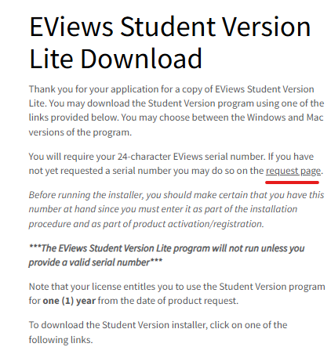
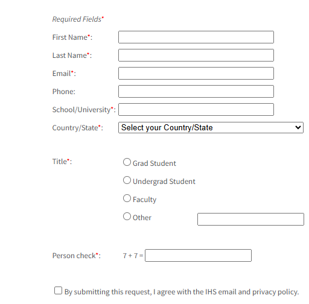
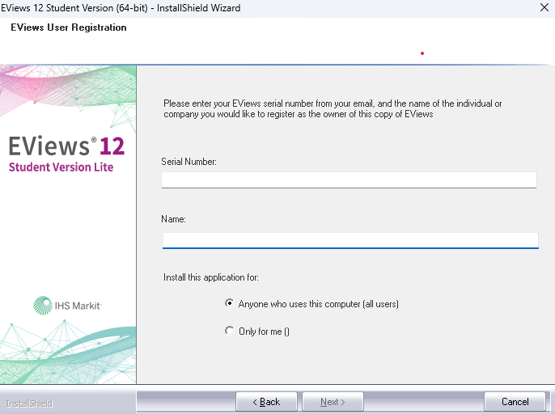

# Preparar o ambiente para EViews

---

# Apenas para Windows

## Aceder à pasta da rede 

> requer ligação à rede `eduroam`

**1.** Pressionar `Win + R` para abrir a janela `Executar`.

**2.** Inserir `\\eviews.ubi.pt\` e pressionar `Enter`.

**3.** Se necessário, inserir as credenciais da UBI.

**4.** Copiar a pasta `EViews13` para uma pasta de fácil acesso no computador (exemplo: `Documentos`) - pode demorar alggum tempo.

>COPIAR A PASTA E NÃO CRIAR UM ATALHO ou ARRASTAR A PASTA

**5.** Abrir a pasta do computador e procurar o ficheiro `EViews13.exe` dentro da pasta `EViews13` copiada.

**6.** Botão direito do rato no ficheiro `EViews13.exe` e escolher `Afixar no Menu Iniciar`.

---

# Para todos os Sistemas Operativos

## Eview student version

> esta versão é limitada, não permite guardar ficheiros

**1.** aceder ao site: https://www.eviews.com/download/student12/ e escolher o sistema operativo.

**2.** Na mesma página do ponto 1., procurar por `Request page` como na imagem:

**3.** Preencher o formulário com o email institucional (terminado em `ubi.pt`) e seguir as instruções para a ativação da conta:

**4.** Abrir o ficheiro de instalação descarregado e seguir as instruções de instalação.

**5.** Inserir o Serial Number que receberam por email:

