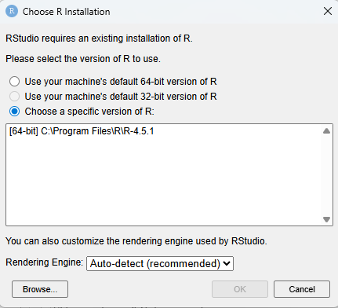
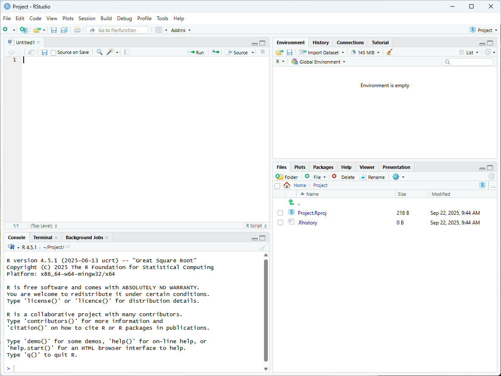
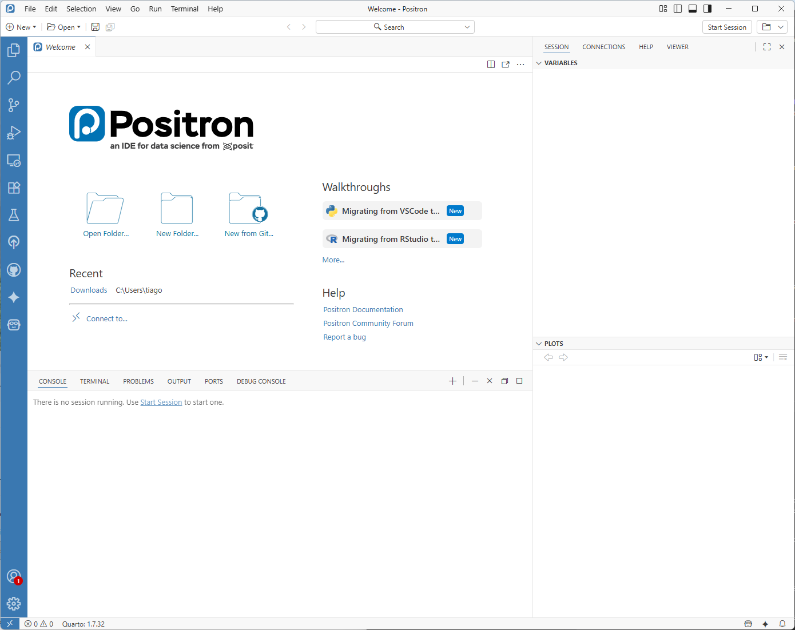
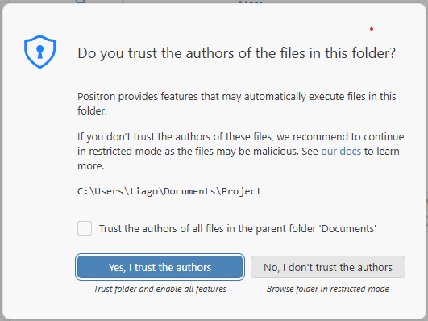
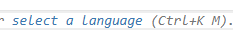
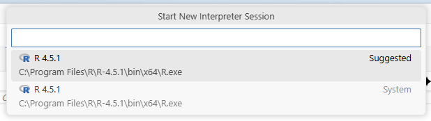
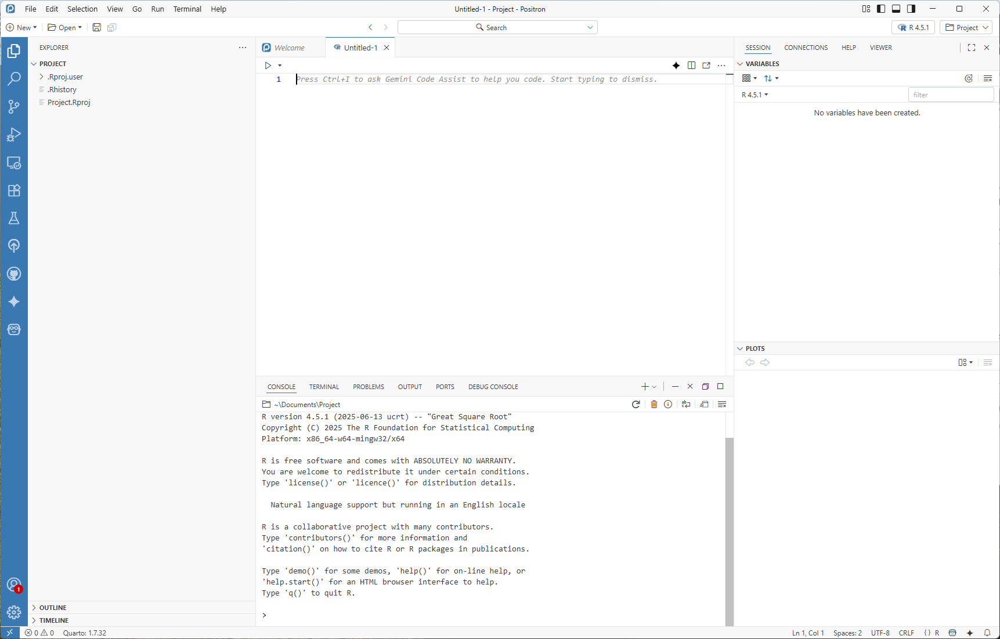

# 00 Preparar ambiente para o R

## 1. Instalar o R
   - Aceder ao site oficial do R: [https://cran.r-project.org/](https://cran.r-project.org/bin/windows/base/)
   Escolher o sistema operativo (Windows, MacOS, Linux) e seguir as instruções de instalação.

## 2. Instalar a interface gráfica

R-Studio ou Positron 

### 2.1 Instalar RStudio

- Aceder a [https://posit.co/downloads/](https://posit.co/downloads/)
- Escolher a versão gratuita do RStudio Desktop e seguir as instruções de instalação.


### 2.2 Instalar Positron

- Aceder a [https://positron.posit.co/download.html](https://positron.posit.co/download.html)
- Escolher a versão do Positron de acrodo com o sistema operativo e seguir as instruções de instalação.


## Primeira utilização

### R Studio Desktop

**1.** Abrir o R Studio e poderá aparecer a imagem:



Escolher a versão do R e clicar em `OK`.

**2.** Criar uma pasta de trabalho para organizar os ficheiros do R. O nome é indiferente, mas o local deve ser fácil de encontrar.

**3.** No R Studio, clicar em `File > New Project > Existing Directory` e escolher a pasta criada no passo anterior. Os ficheiros que serão importados ou criados deverão estar guardados nesta pasta.

**4.** Clicar em `File > New File > R Script` (ctrl+shift+n) para criar um novo script onde serão escritos os comandos do R.

### Visão Geral R-Studio

Com um script aberto o R-studio tem a seguinte estrutura por defeito:



- Superior esquerdo: Script onde são escritos e guardados os comandos do R.
- Inferior esquerdo: `Console` onde são executados os comandos do R e aparecemos resultados.
- Superior direito: `Environment` onde aparecem os dados e as variáveis que estão a ser utilizadas.
- Inferior direito: `Files`, `Plots`, `Packages`, `Help` e `Viewer`, onde se podem ver os ficheiros da pasta de trabalho, os gráficos criados, os pacotes instalados, a ajuda do R e o visualizador de páginas web.

### Positron

**1.** Abrir o Positron e aparece a seguinte estrutura:



**2.** Criar uma pasta de trabalho para organizar os ficheiros do R. O nome é indiferente, mas o local deve ser fácil de encontrar.

**3.** No Positron, clicar em `File > Open Folder` e escolher a pasta criada no passo anterior.

Deve aparecer a seguinte imagem:



Clicar em `Yes, I trust the authors` para abrir a pasta. A estrutura da pasta aparece no painel lateral esquerdo.

Os ficheiros que serão importados ou criados deverão estar guardados nesta pasta.

**4.** Clicar em `File > New Text File ` (ctrl+shift+n) e escolher a linguagem R:



 para criar um novo script onde serão escritos os comandos do R.

 **5.** iniciar o `Inrpreter`, na consola, parte inferior, clicar em `Start Session` e escolher a versão do R instalada:



**6.** Depois de tudo pronto o `Positron` tem a seguinte estrutura:



- Painel lateral esquerdo: Estrutura da pasta de trabalho onde se encontram os ficheiros.
- Superior centro: Script onde são escritos e guardados os comandos do R.
- Inferior centro: `Console` onde são executados os comandos do R e aparecemos resultados.
- Superior direito: `Sesssion/Environment` onde aparecem os dados e as variáveis que estão a ser utilizadas.
- Inferior direito: `Plots`, onde vão aparecer os gráficos criados.

## 3. Instalar bibliotecas

As bibliotecas são conjuntos de funções e dados que facilitam o trabalho com o R. Algumas bibliotecas comuns são `tidyverse` e `readxl`.

Por isso na consola (R-studio ou Positron) escrever o seguinte comando para instalar as bibliotecas necessárias:

```R
install.packages("tidyverse")
install.packages("readxl")
```

Pressionar entre depois de cada linha para executar o comando.

## 4. Carregar bibliotecas

Depois de instaladas as bibliotecas, é necessário carregá-las no script para poder utilizá-las. Escrever o seguinte comando no script:

```R
# Carregar bibliotecas
library(tidyverse)
library(readxl)
```


e pressionar `ctrl+enter` para executar cada linha.
